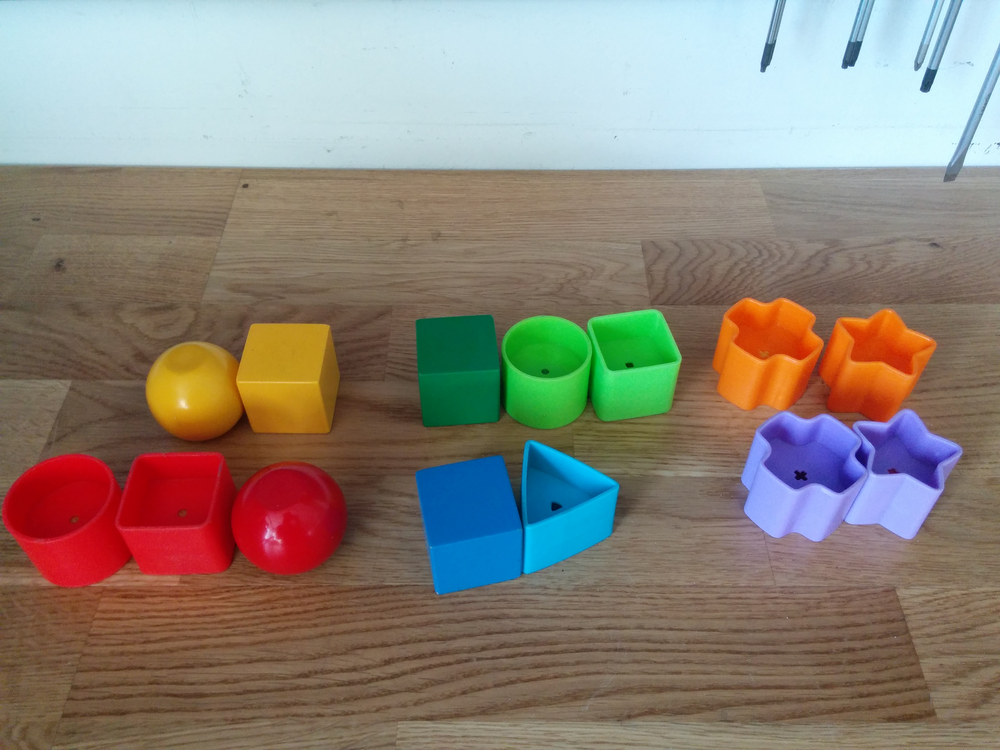

# Object-Detection-on-CPU
This work covers the perception pipeline of our submission for the Robotics and Autonomous Systems Project course [DD2425](https://www.kth.se/student/kurser/kurs/DD2425?l=en). The course involved constructing a mobile robot from scratch to carry out mock search and rescue. The subjects of search and rescue were multi-colored toy blocks shown below: 

The goal was to detect and localize the objects in a scene on an intel NUC platform, **without a GPU**   
