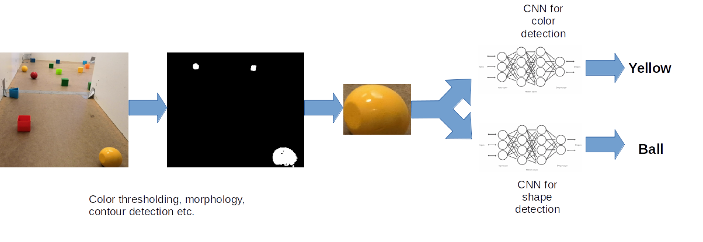

# Object-Detection-on-CPU
This work covers the perception pipeline of our submission for the Robotics and Autonomous Systems Project course [DD2425](https://www.kth.se/student/kurser/kurs/DD2425?l=en). The course involved constructing a mobile robot from scratch to carry out mock search and rescue. The goal was to detect and localize the objects in a scene on an intel NUC platform, **without a GPU**.  The objects were multi-colored toy blocks shown below: 

There are two ways to go about it. One can either use traditional image analysis (like thresholding, morphing, contour detection etc.). Although the approach sounds good on paper, it will never generalize well and be free of outliers. The thresholding parameters may change with the lighting. The shape detection (for instance between a *cube* and a *hollow cube*) and is non-trivial. Another approach is training a neural network. We started by looking at the excellent fork of yolov2 by [AlexeyAB](https://github.com/AlexeyAB/yolo2_light). We observed that even the lightest object detector network gave a measely 0.2 FPS with poor detection accuracy. 

## Approach
The key is to breakdown the problem of object detection into object localization and image classification (which many deep learning methods like R-CNN do). Using traditional image analysis, the algorithm can generate many regions of interest, which can be fed to an image recognition network for accurate detection. Moreover, we used separate CNN for color and shape detection for increased robustness. The pipeline is shown below:

## Steps
1. **Creating a Dataset**: This involved recording videos capturing the scene experienced by the robot, and sampling images from it to create a dataset of objects. Thankfully, one of our seniors (Alvin Lee) created this dataset an year before. But this dataset was suitable for object detection, not image recognition. So, I wrote a script [keras_crop_dataset.py](./keras_crop_dataset.py), which provides a simple GUI to quickly crop, annotate objects from a scene and store them, utilizing the image analysis pipeline shown above. This way I was quickly able to create a dataset with ~8000 samples per object.

2. **Training the CNN**: The number of shapes and colors to be recognized are 7 and 6 respectively. Since the problem is similar to CIFAR-10 image recognition, I used the architecture provided by Keras in their excellent [documentation](https://github.com/keras-team/keras/blob/master/examples/cifar10_cnn.py). These are provided in the [saved_models_1](./saved_models_1) folder along with their training summaries.

3. **Bringing it all together**: check [keras_object_detection.py](./keras_object_detection.py)

## Results/ Videos

**Object Detection on running Robot (~25-30 FPS on CPU)**: The blue box is a region of interest generated by using traditional image analysis and the green box contains the actual detection. The algorithm also uses depth provided by RGBD camera and [camera intrinsics](http://docs.ros.org/kinetic/api/sensor_msgs/html/msg/CameraInfo.html) to compute distances to the object.

Object detection on Robot             |  
:-------------------------:|
  |

## Bonus Videos
1. In addition to valuable objects, the perception system also needed to detect obstacles (grey batteries) and avoid them. The following videos demonstrate the logic behind obstacle detection algorithm. A side-by-side comparison to object detection is also shown to prove robustness.

Obstacle detection             |  Object Detection v/s Obstacle detection
:-------------------------:|:-------------------------:
  |  

## Robotics Project Course Submission
In addition to Perception, the mobile robot also had the following pipelines:
- Localization and mapping using particle filter.
- Path planning and control using A star to traverse from point A to B.
- System Integration using a state machine (smach package in ROS)
If you're interested to know more on how these pipelines are integrated in ROS, check out our [Project page](https://github.com/RAS-2018-grp-4). 

Autonomous Exploration             |  Object Detection v/s Obstacle detection
:-------------------------:|:-------------------------:
  |  

